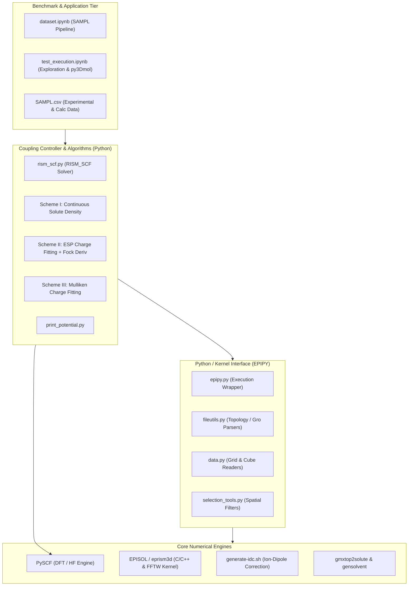
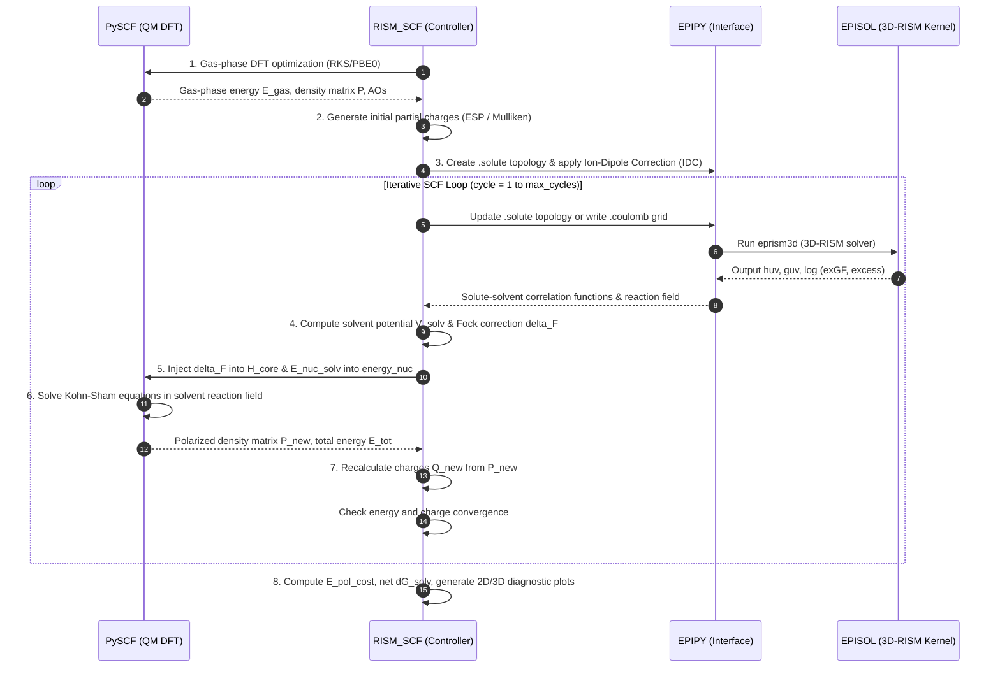

# Architecture of the 3D-RISM-SCF Solvation Framework

This document provides an exhaustive overview of the software architecture, theoretical formulations, numerical algorithms, component interactions, and data flows implemented in this codebase.

---

## 1. Executive Summary & Theoretical Background

This codebase implements a self-consistent **3D-RISM-SCF** (Three-Dimensional Reference Interaction Site Model Self-Consistent Field) method. It couples:
1. **PySCF**: An *ab initio* quantum chemistry package solving the Kohn-Sham Density Functional Theory (DFT) or Hartree-Fock (HF) equations for the solute electron density.
2. **EPISOL (`eprism3d`)**: A high-performance classical statistical mechanics solver that solves the 3D-RISM integral equations for the spatial distribution functions and thermodynamic properties of molecular solvents.

### The Physics of 3D-RISM-SCF
In classical implicit solvent models (e.g., PCM, SMD), the solvent is represented as a structureless dielectric continuum. While computationally fast, continuum models fail to capture microscopic solvent effects such as hydrogen bond networks, steric packing, ion shell formation, and local hydrophobic density fluctuations.

3D-RISM solves the **3D Ornstein-Zernike (3D-OZ) equation**:
$$h_\gamma(\mathbf{r}) = c_\gamma(\mathbf{r}) + \sum_{\alpha} \rho_\alpha \int c_\alpha(\mathbf{r}') \chi_{\alpha\gamma}(|\mathbf{r} - \mathbf{r}'|) d\mathbf{r}'$$
coupled with a closure relation (such as HNC, KH, or PSE-$n$):
$$h_\gamma(\mathbf{r}) = \exp\left[ -\beta u_{u\gamma}(\mathbf{r}) + h_\gamma(\mathbf{r}) - c_\gamma(\mathbf{r}) + B_\gamma(\mathbf{r}) \right] - 1$$
where:
* $\gamma, \alpha$ index the solvent interaction sites (e.g., OW, HW in TIP3P water).
* $h_\gamma(\mathbf{r})$ is the total correlation function, defining the 3D spatial density distribution $g_\gamma(\mathbf{r}) = h_\gamma(\mathbf{r}) + 1$.
* $c_\gamma(\mathbf{r})$ is the direct correlation function.
* $\chi_{\alpha\gamma}(r)$ is the bulk solvent-solvent susceptibility (obtained from 1D-RISM/dielectric models).
* $u_{u\gamma}(\mathbf{r})$ is the solute-solvent interaction potential (Lennard-Jones + Coulomb).
* $\rho_\alpha$ is the bulk number density of solvent site $\alpha$.

In **3D-RISM-SCF**, the solute is not rigid or fixed in charge; the solute electronic structure polarizes in response to the solvent electrostatic reaction field $\hat{V}_{\text{solv}}(\mathbf{r})$, and the solvent density reorganizes in response to the polarized solute:

$$\Delta G_{\text{solv}} = E_{\text{pol}} + \Delta \mu_{\text{RISM}}$$
where $E_{\text{pol}} = E_{\text{solute}}^{\text{polarized}} - E_{\text{solute}}^{\text{gas}}$ is the quantum wave function polarization cost, and $\Delta \mu_{\text{RISM}}$ is the excess chemical potential (solvation free energy) from 3D-RISM.

---

## 2. High-Level Architecture

The software architecture is modularized into four primary tiers:



---

## 3. The 3D-RISM-SCF Iterative Cycle



---

## 4. Detailed Component Breakdown

### 4.1. Core Controller: `rism_scf.py`
`rism_scf.py` contains the object-oriented coupling driver `RISM_SCF` and the numerical implementations of the three solvation schemes:

#### Mathematical Formulations of the Three Schemes

| Feature | Scheme I: Continuous Density | Scheme II: ESP Charge Fitting | Scheme III: Mulliken Fitting |
| :--- | :--- | :--- | :--- |
| **CLI Flag** | `--solute-charge-density` | `--esp-charge-fitting` (Default) | `--mulliken-charge-fitting` |
| **Solute Representation in EPISOL** | Exact continuous potential grid ($V^e + V^{n-e}$) loaded via `.coulomb` | Discrete fitted ESP point charges $\{Q_a\}$ in `.solute` | Discrete Mulliken point charges $\{Q_a\}$ in `.solute` |
| **Solvent Field on Solute** | Numerical quadrature of continuous $V_{\text{solv}}(\mathbf{r})$ over Becke DFT grid | Back-reaction derivative $\Delta F_{\mu\nu}^{\text{solvent}} = \sum_a V_{\text{solv}}(\mathbf{R}_a) \frac{\partial Q_a}{\partial P^{\mu\nu}}$ | Block-wise overlap weighting: $\Delta F_{\mu\nu} = -\frac{1}{2} S_{\mu\nu} (V_A + V_B)$ |
| **Fock Matrix Modification** | $H_{\text{core}}' = H_{\text{core}} + \Delta F^{\text{direct}}$ | $H_{\text{core}}' = H_{\text{core}} + \Delta F^{\text{solvent}}$ | $H_{\text{core}}' = H_{\text{core}} + \Delta F^{\text{Mulliken}}$ |
| **Nuclear Energy Modification** | $E_{\text{nuc}}' = E_{\text{nuc}} + \sum_A Z_A V_{\text{solv}}(\mathbf{R}_A)$ | $E_{\text{nuc}}' = E_{\text{nuc}} + \sum_A Z_A V_{\text{solv}}(\mathbf{R}_A)$ | $E_{\text{nuc}}' = E_{\text{nuc}} + \sum_A Z_A V_{\text{solv}}(\mathbf{R}_A)$ |

#### Scheme I Details (Continuous Solute Potential Grid)
1. **Grid Generation**: Generates 3D Cartesian coordinates matching EPISOL's grid dimensions $(n_x, n_y, n_z)$ and resolution $\Delta h$ (typically 0.25 Å or 0.5 Å).
2. **PySCF Electronic Potential ($V^e$)**: Evaluated in vectorized chunks of 10,000 points using `gto.fakemol_for_charges` and PySCF's 3-center integral routine `df.incore.aux_e2`:
   $$V^e(\mathbf{r}_p) = -\sum_{\mu\nu} P^{\mu\nu} \int \frac{\phi_\mu(\mathbf{r})\phi_\nu(\mathbf{r})}{|\mathbf{r}_p - \mathbf{r}|} d\mathbf{r}$$
3. **Nuclear Potential Correction ($V^{n-e}$)**: Evaluates the difference between full nuclear charges and force-field point charges:
   $$V^{n-e}(\mathbf{r}_p) = \sum_a \frac{Z_a - Q_a}{|\mathbf{r}_p - \mathbf{R}_a|}$$
4. **EPISOL Potential Injection**: Writes $V^{\text{add}} = V^e + V^{n-e}$ in kJ/mol/e to `prefix.coulomb` and passes `-i prefix -cmd load:coul` to EPISOL.
5. **Solvent Reaction Field Integration**: Integrates the solvent electrostatic potential $V_{\text{solv}}(\mathbf{r})$ over atom-centered Becke grids using manually computed Becke partition weights ($s_3$ with 3 smoothing iterations):
   $$\Delta F_{\mu\nu}^{\text{direct}} = -\sum_g w_g V_{\text{solv}}(\mathbf{r}_g) \phi_\mu(\mathbf{r}_g) \phi_\nu(\mathbf{r}_g)$$

#### Scheme II Details (CHELPG ESP Fitting + Exact Fock Derivative)
1. **CHELPG Grid**: Points generated in a bounding box extending $r_{\text{max}} = 2.8$ Å around the solute, excluding the interior of van der Waals spheres.
2. **Constrained Least Squares**:
   $$\begin{pmatrix} \mathbf{M}^T\mathbf{M} & \mathbf{1} \\ \mathbf{1}^T & 0 \end{pmatrix} \begin{pmatrix} \mathbf{Q} \\ \lambda \end{pmatrix} = \begin{pmatrix} \mathbf{M}^T\mathbf{V}_{\text{total}} \\ Q_{\text{tot}} \end{pmatrix}$$
3. **Fock Matrix Derivative (Polarization Back-Reaction)**:
   $$\Delta F_{\mu\nu}^{\text{solvent}} = \frac{\partial \Delta \mu}{\partial P^{\mu\nu}} = \sum_p f_p \langle \phi_\mu | \frac{1}{|\mathbf{r} - \mathbf{r}_p|} | \phi_\nu \rangle$$
   where $w_b = \sum_a A^{-1}_{ba} V_{\text{solv}}(\mathbf{R}_a)$, $f_p = -\sum_b M_{pb} w_b$, and the 3-center integral is computed analytically via PySCF's density fitting module.

#### Scheme III Details (Mulliken Charge Fitting)
1. **Mulliken Charges**:
   $$Q_a = Z_a - (\mathbf{P}\mathbf{S})_{a} = Z_a - \sum_{\mu \in a} \sum_\nu P^{\mu\nu} S_{\nu\mu}$$
2. **Symmetrized Fock Matrix Correction**:
   $$\Delta F_{\mu\nu}^{\text{Mulliken}} = -\frac{1}{2} S_{\mu\nu} \left( V_{\text{solv}}(\mathbf{R}_{\text{atom}(\mu)}) + V_{\text{solv}}(\mathbf{R}_{\text{atom}(\nu)}) \right)$$

---

### 4.2. Spatial Potential Solvers in `rism_scf.py`
The solvent potential $V_{\text{solv}}(\mathbf{r})$ is obtained from the total correlation functions $h_{\text{OW}}(\mathbf{r})$ and $h_{\text{HW}}(\mathbf{r})$:
$$\rho_{\text{solv}}(\mathbf{r}) = q_{\text{OW}} \rho_{\text{OW}} h_{\text{OW}}(\mathbf{r}) + q_{\text{HW}} \rho_{\text{HW}} h_{\text{HW}}(\mathbf{r})$$

Two complementary algorithms are provided:
1. **3D FFT Poisson Solver (`compute_solvent_potential_grid_fft`)**:
   Solves Poisson's equation in reciprocal space:
   $$V(\mathbf{k}) = \frac{4\pi \rho(\mathbf{k})}{k^2}, \quad V(\mathbf{k}=\mathbf{0}) = 0$$
   Applies an inverse 3D FFT to yield the full Cartesian potential grid in $\mathcal{O}(N \log N)$ time.
2. **Direct Real-Space Summation (`compute_solvent_potential_at_coords_real_space`)**:
   Computes $V_{\text{solv}}(\mathbf{r}) = \sum_k \frac{q_k}{|\mathbf{r} - \mathbf{r}_k|}$ directly with optional grid downsampling, avoiding periodic wrap-around artifacts.
3. **Cavity-Excluded Potential at Nuclei (`compute_solvent_potential_at_nuclei`)**:
   Computes the potential at atomic nuclei while excluding grid points inside the nuclear van der Waals radii to prevent Coulomb singularity divergence.

---

### 4.3. Interface Layer: `episol` (Python Package `epipy`)
* **`epipy.py`**: Handles initialization, topology conversion, command-line argument construction, and subprocess invocation of `eprism3d`.
* **`fileutils.py`**: Robust parser for GROMACS `.top`, `.gro`, Amber `.prmtop`, and EPISOL `.solute` files.
* **`data.py`**: Decompresses `.ts4s` binary dumps into NumPy arrays, exports Gaussian Cube / DX formats for visualization, and applies Laplacian/LoG filters.
* **`selection_tools.py`**: Spatial filtering routines implementing the minimum image convention.

---

### 4.4. Classical Kernel: `episol/release`
The computational heavy lifting of 3D-RISM is implemented in C/C++:
* **`eprism3d`**: The core numerical engine. Performs 3D fast Fourier transforms using FFTW 3.3.8, applies closure relationships (HNC, PSE-n), and accelerates convergence via modified DIIS (Direct Inversion in the Iterative Subspace).
* **`gmxtop2solute`**: Converts GROMACS force fields to EPISOL site parameters.
* **`generate-idc.sh`**: Implements Siqin Cao's Ion-Dipole Correction (IDC), adjusting site radii and dielectric constants to eliminate spurious over-binding of water oxygens to anions.
* **`ts4sdump`**: Extracts binary correlation grids into human-readable text formats.

---

## 5. Coordinate Systems, Units, and Data Layouts

Careful alignment and unit conversion are essential across the PySCF and EPISOL boundary:

| Parameter | PySCF Frame | EPISOL Frame | GROMACS Frame | Conversion Formula |
| :--- | :--- | :--- | :--- | :--- |
| **Length / Distance** | Bohr ($a_0$) | Ångström (Å) | Nanometer (nm) | $1\text{ nm} = 10\text{ Å} = 18.8973\text{ Bohr}$ |
| **Energy** | Hartree ($E_h$) | kJ/mol | kJ/mol | $1\text{ Hartree} = 2625.5002\text{ kJ/mol} = 627.509\text{ kcal/mol}$ |
| **Electrostatic Potential** | Hartree / $e$ | kJ/mol / $e$ | kJ/mol / $e$ | $V_{\text{kJ}} = V_{\text{Hartree}} \times 2625.5002$ |
| **Charge Density** | $e / a_0^3$ | $e / \text{Å}^3$ | $e / \text{nm}^3$ | $\rho_{\text{Å}^{-3}} = \rho_{a_0^{-3}} \times 6.748333$ |
| **Grid Storage Order** | Atom-centered | C-order $(n_z, n_y, n_x)$ | Cartesian box | Meshed using `indexing='ij'` |

### Coordinate Alignment
Because PySCF coordinates can be molecule-centered while GROMACS/EPISOL coordinates are box-centered (typically centered at $[L_x/2, L_y/2, L_z/2]$), `parse_gro_to_pyscf_atoms` constructs the PySCF `Mole` object directly from the GROMACS `.gro` file. This guarantees that:
$$\mathbf{d} = \mathbf{R}_{\text{gro}} - \mathbf{R}_{\text{pyscf}} = [0.0, 0.0, 0.0]\text{ Å}$$
eliminating artificial rotational and translational offsets.

---

## 6. Directory Structure & File Inventory

```
dft-rism/
├── ARCHITECTURE.md                  # This document
├── README.md                        # Project overview and run guides
├── requirements.txt                 # Python dependencies
├── SAMPL.csv                        # Benchmark dataset of experimental and calculated free energies
│
├── rism_scf.py                      # Main 3D-RISM-SCF solver and Scheme I, II, III implementations
├── print_potential.py               # Diagnostic script printing solvent potentials at nuclei
│
├── dataset.ipynb                    # High-throughput automated pipeline for the SAMPL dataset
├── test_execution.ipynb             # Exploratory analysis and py3Dmol 3D visualizer
│
├── CH3COOH.gro, CH3COOH.sdf, acid.top # Test case: Acetic acid solute
├── water.gro, water.sdf, water.top    # Test case: Water molecule
├── methane.gro, methane.top           # Test case: Methane solute
│
├── episol/                          # EPISOL source code and build directories
│   ├── fftw-3.3.8/                  # FFTW 3.3.8 library source
│   ├── release/                     # EPISOL kernel C/C++ source and compiled binaries
│   │   ├── eprism3d                 # Core 3D-RISM solver executable (Mach-O arm64)
│   │   ├── episol                   # EPISOL unified CLI executable
│   │   ├── gmxtop2solute            # GROMACS topology converter executable
│   │   ├── generate-idc.sh          # Ion-Dipole Correction script
│   │   ├── gensolvent               # Solvent file generator executable
│   │   ├── ts4sdump                 # Binary TS4S data unpacker executable
│   │   └── solvent/                 # Solvent parameter definitions (TIP3P-AMBER, etc.)
│   │       ├── tip3p-amber14.01A.gaff
│   │       └── gvv.tip3p.1DDRISM.01A.txt
│
├── to_go/                           # Validation test directory (Ag+, U+4, methane)
└── papers/                          # Foundational scientific papers on 3D-RISM-SCF and EPISOL
```

---

## 7. Environment Setup & Execution Instructions

### 7.1. Installing the EPISOL Kernel
The kernel binaries must be installed to a user-writable path (e.g. `$HOME/episol/bin`):
```bash
cd episol/release
make install prefix=$HOME/episol
```

Add the binaries and solvent definitions to your environment (`~/.zshrc`):
```bash
export PATH="$HOME/episol/bin:$PATH"
export IETLIB="$HOME/episol/share/eprism3d/solvent"
```

### 7.2. Running 3D-RISM-SCF Calculations
From the repository root:

* **Scheme II: ESP Charge Fitting (Default & Recommended)**
  ```bash
  python rism_scf.py --esp-charge-fitting --max-cycles 5
  ```
* **Scheme I: Continuous Solute Charge Density**
  ```bash
  python rism_scf.py --solute-charge-density --max-cycles 5
  ```
* **Scheme III: Mulliken Charge Fitting**
  ```bash
  python rism_scf.py --mulliken-charge-fitting --max-cycles 5
  ```

### 7.3. Using the Python API in Scripts / Notebooks
```python
from rism_scf import RISM_SCF

# Initialize solver
solver = RISM_SCF(
    solute_geometry="water.sdf",
    gro_path="water.gro",
    top_path="water.top",
    scheme="esp",
    max_cycles=5
)

# Run calculation
solver.run()

# Retrieve results
print(f"Polarization Cost   : {solver.E_pol_cost:.3f} kcal/mol")
print(f"3D-RISM Excess Free Energy : {solver.exGF_kcal:.3f} kcal/mol")
print(f"Net Hydration Free Energy  : {solver.dG_solv:.6f} Hartree")
print(f"Polarized Partial Charges  : {solver.charges}")
```
