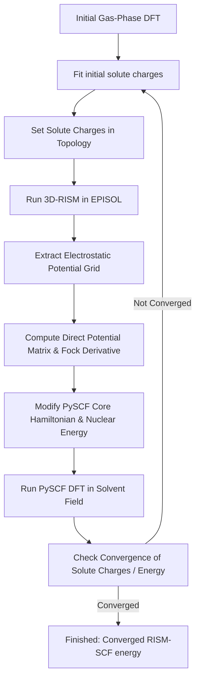

# 3D-RISM-SCF Solvation Calculations in PySCF

This workspace contains code and inputs to perform self-consistent **3D-RISM-SCF** solvation calculations on solute molecules by coupling the quantum chemical DFT solver **PySCF** and the classical 3D-RISM statistical mechanics solver **EPISOL** (interfaced via `epipy`).

---

## The 3D-RISM-SCF Coupling Loop

The code implements the self-consistent coupling loop between the solute electronic structure (Quantum Mechanics) and the solvent structure (Statistical Mechanics) as illustrated below:



---

## Detailed Function Descriptions & Mathematical Formulations

Here is a comprehensive breakdown of every function implemented along with the equations describing their physical and mathematical formulation.

### 1. `update_solute_charges`
* **Purpose:** Updates the solute topology file (typically `idc_acid.solute`) with the newly calculated solute atomic partial charges at the end of each RISM-SCF cycle.
* **Mathematical Formulation:** 
  The function reads the topology text file and updates the 6th column (index 5) representing the partial charges $\{Q_a\}$ of the solute sites:
  $$Q_a \leftarrow \text{charges}[a]$$
  This modified topology is written back to disk so that the classical 3D-RISM solver (`epipy`) uses the polarized solute charges in the next statistical mechanics step.

---

### 2. `fit_esp_charges`
* **Purpose:** Fits partial atomic charges $\{Q_a\}$ to reproduce the exact quantum electrostatic potential (ESP) of the solute (nuclei + continuous electron density) on a grid of points surrounding the molecule (CHELPG scheme).
* **Mathematical Formulation:**
  The electrostatic potential $V_{\text{total}}(\mathbf{r}_p)$ generated by the solute at a grid point $\mathbf{r}_p$ is the sum of nuclear and electronic contributions:
  $$V_{\text{total}}(\mathbf{r}_p) = V_{\text{nuc}}(\mathbf{r}_p) + V_{\text{elec}}(\mathbf{r}_p) = \sum_a \frac{Z_a}{|\mathbf{r}_p - \mathbf{R}_a|} - \sum_{\mu\nu} P^{\mu\nu} \int \frac{\phi_\mu(\mathbf{r})\phi_\nu(\mathbf{r})}{|\mathbf{r}_p - \mathbf{r}|} d\mathbf{r}$$
  where $Z_a$ and $\mathbf{R}_a$ are the nuclear charge and coordinates of atom $a$, $\phi_\mu$ are the atomic orbitals, and $P$ is the density matrix.

  We fit a set of point charges $\{Q_a\}$ located at the atomic centers $\mathbf{R}_a$ to minimize the square difference:
  $$\chi^2 = \frac{1}{2} \sum_p \left( \sum_a M_{pa} Q_a - V_{\text{total}}(\mathbf{r}_p) \right)^2 \quad \text{where } M_{pa} = \frac{1}{|\mathbf{r}_p - \mathbf{R}_a|}$$
  subject to the constraint that the sum of partial charges equals the total charge of the molecule $Q$:
  $$\sum_a Q_a = Q$$
  
  Using the Lagrange multiplier method, the objective function is:
  $$L(\mathbf{Q}, \lambda) = \frac{1}{2} \sum_p \left( \sum_a M_{pa} Q_a - V_{\text{total}}(\mathbf{r}_p) \right)^2 + \lambda \left( \sum_a Q_a - Q \right)$$
  Taking the derivative with respect to $Q_b$ and setting it to zero yields:
  $$\sum_a (\mathbf{M}^T\mathbf{M})_{ba} Q_a + \lambda = (\mathbf{M}^T\mathbf{V}_{\text{total}})_b$$
  This corresponds to solving the constrained linear system $\mathbf{A} \mathbf{x} = \mathbf{B}$:
  $$\begin{pmatrix} \mathbf{M}^T\mathbf{M} & \mathbf{1} \\ \mathbf{1}^T & 0 \end{pmatrix} \begin{pmatrix} \mathbf{Q} \\ \lambda \end{pmatrix} = \begin{pmatrix} \mathbf{M}^T\mathbf{V}_{\text{total}} \\ Q \end{pmatrix}$$

---

### 3. `compute_fock_derivative`
* **Purpose:** Computes the density-derivative contribution $\Delta F_{\mu\nu}^{\textrm{solvent}}$ to the effective Fock matrix arising from the dependence of the fitted ESP charges on the solute density matrix.
* **Mathematical Formulation:**
  The electrostatic solvation energy is:
  $$\Delta \mu = \mathbf{V}_{\text{solv}}^T \mathbf{Q} = \sum_a V_{\text{solv}}(\mathbf{R}_a) Q_a$$
  where $V_{\text{solv}}(\mathbf{R}_a)$ is the electrostatic potential generated by the solvent reaction field at the position of nucleus $a$.
  The Fock matrix contribution is the partial derivative of this free energy with respect to the density matrix element $P^{\mu\nu}$:
  $$\Delta F_{\mu\nu}^{\textrm{solvent}} = \frac{\partial \Delta \mu}{\partial P^{\mu\nu}} = \sum_a V_{\text{solv}}(\mathbf{R}_a) \frac{\partial Q_a}{\partial P^{\mu\nu}}$$
  
  Differentiating the constrained ESP fitting linear system $\mathbf{A} \mathbf{x} = \mathbf{B}$ (with respect to $P^{\mu\nu}$):
  $$Q_a = \sum_b A^{-1}_{ab} B_b + A^{-1}_{a, N_{\text{atm}}+1} Q \quad \text{where } \mathbf{A}^{-1}_{(\text{top-left})} \text{ is the submatrix of the inverse}$$
  Since $Q$ is constant, $\partial Q / \partial P^{\mu\nu} = 0$. The derivative of $V_{\text{total}}(\mathbf{r}_p)$ with respect to $P^{\mu\nu}$ is:
  $$\frac{\partial V_{\text{total}}(\mathbf{r}_p)}{\partial P^{\mu\nu}} = \frac{\partial V_{\text{elec}}(\mathbf{r}_p)}{\partial P^{\mu\nu}} = -\langle \phi_\mu | \frac{1}{|\mathbf{r} - \mathbf{r}_p|} | \phi_\nu \rangle$$
  Therefore, the derivative of the charge $Q_a$ is:
  $$\frac{\partial Q_a}{\partial P^{\mu\nu}} = - \sum_{b=1}^{N_{\text{atm}}} A^{-1}_{ab} \sum_p M_{pb} \langle \phi_\mu | \frac{1}{|\mathbf{r} - \mathbf{r}_p|} | \phi_\nu \rangle$$
  
  Substituting this back into the Fock matrix derivative expression and rearranging sums:
  $$\Delta F_{\mu\nu}^{\textrm{solvent}} = \sum_p \left[ - \sum_{b=1}^{N_{\text{atm}}} M_{pb} \left( \sum_{a=1}^{N_{\text{atm}}} A^{-1}_{ba} V_{\text{solv}}(\mathbf{R}_a) \right) \right] \langle \phi_\mu | \frac{1}{|\mathbf{r} - \mathbf{r}_p|} | \phi_\nu \rangle$$
  
  Defining the intermediate weight vector $\mathbf{w}$ and grid point charge vector $\mathbf{f}$:
  $$w_b = \sum_{a=1}^{N_{\text{atm}}} A^{-1}_{ba} V_{\text{solv}}(\mathbf{R}_a)$$
  $$f_p = - \sum_{b=1}^{N_{\text{atm}}} M_{pb} w_b$$
  
  We obtain a simple electrostatic expression representing the back-reaction:
  $$\Delta F_{\mu\nu}^{\textrm{solvent}} = \sum_p f_p \langle \phi_\mu | \frac{1}{|\mathbf{r} - \mathbf{r}_p|} | \phi_\nu \rangle$$
  This integral is evaluated analytically using PySCF's 3-center integral density-fitting module:
  `delta_F_deriv = np.einsum('ijp,p->ij', df.incore.aux_e2(mol, fakemol), f)`

---

### 4. `continous_solute_charge_density`
* **Purpose:** Calculates the direct continuous solvent potential contribution $\delta F_{\mu\nu}^{\text{direct}}$ to the Fock matrix (Scheme I).
* **Mathematical Formulation:**
  Integrates the solvent electrostatic potential $V_{\text{solv}}(\mathbf{r})$ over the atomic orbital basis by interpolating the Cartesian potential grid onto PySCF's multi-center **atom-centered grid** points $\{\mathbf{r}_g\}$ shifted by the translation vector $\mathbf{d}$:
  $$\mathbf{r}_g \leftarrow \mathbf{r}_g + \mathbf{d}$$
  $$V_{\mu\nu}^{\text{direct}} = \langle \phi_\mu | \hat{V}_{\text{solv}} | \phi_\nu \rangle \approx \sum_g w_g V_{\text{solv}}(\mathbf{r}_g + \mathbf{d}) \phi_\mu(\mathbf{r}_g) \phi_\nu(\mathbf{r}_g)$$
  In Python, this integration is implemented as:
  `aow = np.einsum('pi,p,p->pi', ao, weights, v_solv_grid)  # where v_solv_grid = pot_interpolator(coords_ang + d) / 627.509`
  `delta_F_direct = np.dot(ao.T, aow)`

---

### 5. `get_mulliken_charges` & `mulliken_charge_fitting`
* **Purpose:** Computes Mulliken partial charges and the corresponding solvation contribution to the Fock matrix using Mulliken population analysis (Scheme III).
* **Mathematical Formulation:**
  - **Mulliken Charges ($Q_a$):**
    $$Q_a = Z_a - \sum_{\mu \in a}\sum_{\nu}\mathbf{P}^{\mu\nu}\mathbf{S}_{\mu\nu}$$
    where $Z_a$ is the nuclear charge of atom $a$, $\mathbf{D}$ is the density matrix, and $\mathbf{S}$ is the overlap matrix.
  - **Mulliken Solvation Fock Correction ($\Delta F_{\mu\nu}^{\text{Mulliken}}$):**
    Taking the derivative of the solvation energy $\Delta \mu = \sum_a Q_a V_{\text{solv}}(\mathbf{R}_a)$ with respect to the density matrix and symmetrizing yields:
    $$\Delta F_{\mu\nu}^{\text{Mulliken}} = - \frac{1}{2} S_{\mu\nu} \left( V_{\text{solv}}(\mathbf{R}_{\text{atom}(\mu)}) + V_{\text{solv}}(\mathbf{R}_{\text{atom}(\nu)}) \right)$$
    In Python, this is implemented block-wise for each pair of atoms $a$ and $b$:
    `delta_F[p0:p1, q0:q1] = -0.5 * s_matrix[p0:p1, q0:q1] * (V_A + V_B)`

---

### 6. `RISM_SCF` Class & `run_rism_scf` wrapper
* **Purpose:** Establishes and manages the self-consistent coupling loop as an object-oriented solver. It supports three solvation schemes:
  - **Continuous Solute Charge Density (Scheme I):**
    $$H_{\text{core}}' = H_{\text{core}} + \Delta F^{\text{direct}}$$
  - **ESP Charge Fitting (Scheme II):**
    $$H_{\text{core}}' = H_{\text{core}} + \Delta F^{\textrm{solvent}}$$
  - **Mulliken Charge Fitting (Scheme III):**
    $$H_{\text{core}}' = H_{\text{core}} + \Delta F^{\text{Mulliken}}$$
  In all schemes, the nuclear-solvent interaction energy $E_{\text{nuc-solv}} = \sum_A Z_A V_{\text{solv}}(\mathbf{R}_A)$ is added to the nuclear repulsion energy of the molecule.
  
  At the end of the calculation, it parses the 3D-RISM log to compute the physical net hydration free energy:
  $$\Delta G_{\text{solv}} = E_{\text{pol}} + \Delta \mu_{\text{RISM}}$$
  where $E_{\text{pol}} = E_{\text{solute}}^{\text{polarized}} - E_{\text{solute}}^{\text{gas}}$ is the wave function polarization cost.

---

## Programmatic Usage (Python API)

You can import and run the calculation as an object to easily extract physical energies and charges:

```python
from rism_scf import RISM_SCF

# 1. Initialize the solver object
solver = RISM_SCF(
    solute_geometry="CH3COOH.sdf",   # Can also be an RDKit Mol object or PySCF Mole object
    gro_path="CH3COOH.gro", 
    top_path="acid.top", 
    scheme='esp', 
    max_cycles=3
)

# 2. Run the calculation
solver.run()

# 3. Extract results from attributes
print(f"Polarization Cost : {solver.E_pol_cost} kcal/mol")
print(f"RISM Excess energy: {solver.exGF_kcal} kcal/mol")
print(f"Net dG of Solvation: {solver.dG_solv} Hartree")
print(f"Polarized Charges : {solver.charges}")
```

### Supported Solute Geometry Inputs
The `solute_geometry` parameter is highly robust and accepts three types:
1. **SDF File / Geometry String (`str`):** Loads coordinates using PySCF's standard geometry parser.
2. **RDKit Molecule (`rdkit.Chem.Mol`):** Automatically extracts symbols and 3D conformer coordinates (in Ångstroms) to build the PySCF `gto.Mole` object.
3. **PySCF Mole (`pyscf.gto.Mole`):** Uses a pre-built Mole object directly.

---

## Installation & EPISOL Configuration

This framework couples **PySCF** (quantum chemical DFT solver) with **EPISOL** / `eprism3d` (classical 3D-RISM statistical mechanics solver), interfaced through the Python package `episol` (`epipy`). Setting up the environment requires:
1. Compiling and installing the classical **EPISOL C/C++ kernel** (`eprism3d` and helper utilities).
2. Configuring required **environment variables** (`PATH` and `IETLIB`).
3. Installing the **Python dependencies** and the `episol` interface package.
4. Verifying the setup.

---

### Step 1: System Prerequisites

Ensure you have a C/C++ compiler and FFTW 3 installed:

* **Compiler & Build Tools:**
  * **macOS:** Install Xcode Command Line Tools:
    ```bash
    xcode-select --install
    ```
  * **Linux (Ubuntu/Debian):**
    ```bash
    sudo apt-get update && sudo apt-get install -y build-essential autoconf automake
    ```

* **FFTW 3 Library:**
  * **Option A: System Package Manager (Recommended)**
    * macOS (Homebrew): `brew install fftw`
    * Linux (Ubuntu/Debian): `sudo apt-get install -y libfftw3-dev`
    * Linux (Fedora/RHEL): `sudo dnf install -y fftw-devel`
  * **Option B: Build FFTW 3.3.8 from bundled source**
    If compiling FFTW locally from source:
    ```bash
    cd episol/fftw-3.3.8
    ./configure --prefix=$HOME/episol/fftw-3.3.8
    make -j$(nproc 2>/dev/null || sysctl -n hw.ncpu)
    make install
    cd ../..
    ```

---

### Step 2: Build and Install the EPISOL Kernel

Build the EPISOL binaries and install them to a user-specified prefix (default: `$HOME/episol`):

```bash
cd episol/release
chmod -R +x configure config_aux
```

Configure and compile:
* **With locally built FFTW (Option B above):**
  ```bash
  ./configure --prefix=$HOME/episol --with-fftw=$HOME/episol/fftw-3.3.8
  make -j$(nproc 2>/dev/null || sysctl -n hw.ncpu)
  make install
  cd ../..
  ```
* **With Homebrew FFTW on macOS:**
  ```bash
  ./configure --prefix=$HOME/episol --with-fftw=$(brew --prefix fftw)
  make -j$(sysctl -n hw.ncpu)
  make install
  cd ../..
  ```
* **With system FFTW in standard search paths (`/usr` or `/usr/local` on Linux):**
  ```bash
  ./configure --prefix=$HOME/episol
  make -j$(nproc)
  make install
  cd ../..
  ```

#### Installed Executables (`$HOME/episol/bin`)
The installation installs the following core tools into `$HOME/episol/bin`:
| Executable | Role |
| :--- | :--- |
| `eprism3d` | Core 3D-RISM and HI statistical mechanics numerical solver |
| `episol` | Unified EPISOL command-line utility |
| `gmxtop2solute` | Converts GROMACS `.top` force-field definitions into EPISOL `.solute` format |
| `generate-idc.sh` | Shell script applying the Ion-Dipole Correction (IDC) to solute topologies |
| `gensolvent` | Builds solvent parameter files from trajectory/coordinate inputs |
| `ts4sdump` | Decompresses and extracts `.ts4s` binary grid outputs to text/data tables |
| `heatmap` | Renders 2D slice visualization files from 3D distribution grids |

---

### Step 3: Configure Environment Variables

The EPISOL executables must be discovered in your `$PATH`, and EPISOL needs the `$IETLIB` variable to locate solvent parameter files (such as `tip3p-amber14.01A.gaff` and water-water RDF tables).

Add the following lines to your shell profile (`~/.zshrc` on macOS or `~/.bashrc` on Linux):

```bash
# EPISOL binary directory
export PATH="$HOME/episol/bin:$PATH"

# EPISOL solvent parameter library
export IETLIB="$HOME/episol/share/eprism3d/solvent"
```

Apply the changes to your current shell session:
```bash
source ~/.zshrc   # or source ~/.bashrc
```

> [!NOTE]
> `rism_scf.py` includes built-in fallback routines that automatically inspect standard locations (such as `$HOME/episol/bin` and the local `./episol/release` directory) if the environment variables are not pre-set in your shell. However, setting them in your shell profile ensures complete compatibility with CLI utilities, Jupyter notebooks, and external pipelines.

---

### Step 4: Python Environment & Dependencies

1. **Create and activate a virtual environment** (Python 3.10+ recommended):
   ```bash
   conda create -n dft-rism python=3.11 -y
   conda activate dft-rism
   ```

2. **Install Python dependencies:**
   ```bash
   pip install pyscf episol numpy scipy matplotlib rdkit
   ```
   *(or `pip install -r requirements.txt`)*

> [!TIP]
> The Python interface `episol` (v0.2.0+) is available on PyPI (`pip install episol`) and can also be installed directly from source via GitHub:
> ```bash
> pip install git+https://github.com/EPISOLrelease/EPIPY.git
> ```

---

### Step 5: Verify the EPISOL Installation

To verify that the EPISOL kernel, environment variables, and Python interface are configured correctly, run:

```bash
python -c "import episol; from episol import epipy"
```

**Expected output:**
```text
All Checks complete
Good to go!
```

If any executable is missing from `$PATH`, `episol` will display warnings indicating which tool cannot be found (e.g., `We cannot find ts4sdump...`). Ensure `$HOME/episol/bin` is in `$PATH` and that `make install` completed successfully.

---

## How to Run

### Input Files
To run a self-consistent 3D-RISM-SCF calculation, three solute input files are required:
1. **Solute 3D Geometry:** `.sdf`, `.xyz`, or an RDKit `Mol` / PySCF `Mole` object (defining quantum molecular structure).
2. **Solute Coordinates:** `.gro` file (specifying box dimensions and solute position in EPISOL coordinates).
3. **Solute Topology:** `.top` file (GROMACS format) or a pre-generated `.solute` file.

Default sample inputs for water (`water.sdf`, `water.gro`, `water.top`) and acetic acid (`CH3COOH.sdf`, `CH3COOH.gro`, `acid.top`) are provided in the repository.

### Command-Line Execution
Run the driver script `rism_scf.py` with your desired solvation coupling scheme:

* **Scheme II: ESP Charge Fitting (Default & Recommended):**
  Uses CHELPG point charges with exact analytic Fock matrix derivative back-reaction.
  ```bash
  python rism_scf.py --esp-charge-fitting --max-cycles 5
  ```

* **Scheme I: Continuous Solute Charge Density:**
  Computes continuous electronic potential on the 3D grid and injects it directly into EPISOL.
  ```bash
  python rism_scf.py --solute-charge-density --max-cycles 5
  ```

* **Scheme III: Mulliken Charge Fitting:**
  Uses Mulliken population charges with symmetrized Fock matrix correction.
  ```bash
  python rism_scf.py --mulliken-charge-fitting --max-cycles 5
  ```

#### CLI Options
| Argument | Description | Default |
| :--- | :--- | :--- |
| `--esp-charge-fitting` | Run Scheme II (ESP charges + exact Fock derivative) | Active by default |
| `--solute-charge-density` | Run Scheme I (Continuous QM ESP grid injection) | Disabled |
| `--mulliken-charge-fitting` | Run Scheme III (Mulliken charges + block Fock correction) | Disabled |
| `--max-cycles <N>` | Maximum number of RISM-SCF coupling cycles | `5` |
| `--basis <basis>` | Quantum chemical basis set for PySCF | `6-311++g**` |
| `--real-space` | Use direct real-space Coulomb summation instead of 3D FFT | Disabled |
| `--downsample <N>` | Source grid downsampling factor for real-space summation | `2` |

---

## Continuous Solute Potential Grid Integration in Scheme I

To enable a fully continuous representation of the solute's electrostatic field in **Scheme I**, we replace the classical point-charge-based electrostatic field inside the 3D-RISM solver (EPISOL) with the actual quantum electrostatic potential (ESP) calculated on the 3D grid.

---

## 1. Coordinate System Alignment (Translation Shift)

Because the solute coordinates in PySCF (`mol.atom_coords()`, centered around `0,0,0` Å) differ from those in EPISOL (box-centered around `15,15,15` Å), we calculate a translation vector $\mathbf{d}$ at the beginning of the workflow:
$$\mathbf{d} = \mathbf{R}_{\text{gro}, 0} - \mathbf{R}_{\text{sdf}, 0}$$

This shift vector $\mathbf{d}$ is applied to align coordinates across all operations:
* **PySCF -> EPISOL (Grid Evaluation):** $\mathbf{r}_{\text{PySCF}} = \mathbf{r}_{\text{EPISOL}} - \mathbf{d}$
* **EPISOL -> PySCF (Solvent potential interpolation):** $\mathbf{r}_{\text{EPISOL}} = \mathbf{r}_{\text{PySCF}} + \mathbf{d}$

---

## 2. Implementation Steps in Cycle Loop

### Step 1: Get EPISOL Grid Coordinates
The 3D Cartesian grid coordinates of EPISOL are generated in Angstroms:
$$x_i = i \cdot \Delta h \quad y_j = j \cdot \Delta h \quad z_k = k \cdot \Delta h$$
Using `np.meshgrid` with C-style row-major ordering (`indexing='ij'`), we generate grid points in shape `(nz, ny, nx, 3)` matching EPISOL's C-contiguous order.

### Step 2: Evaluate Electronic Potential ($V^e$) in PySCF
The grid points are shifted to the PySCF frame ($\mathbf{r}_{\text{PySCF}} = \mathbf{r}_{\text{EPISOL}} - \mathbf{d}$) and converted to Bohr. The electronic potential $V^e$ is evaluated in memory-safe chunks of $10,000$ points:
```python
fakemol = gto.fakemol_for_charges(chunk_points_bohr)
ao_ao_p = df.incore.aux_e2(mol, fakemol)
V_elec_chunk = -np.einsum('ijp,ij->p', ao_ao_p, dm)
```

### Step 3: Compute Nuclear Correction Potential ($V^{n-e}$)
The potential correction generated by the difference between nuclear charges and solute point charges ($Z_\alpha - Q_\alpha$) is calculated analytically:
$$V^{n-e}(\mathbf{r}_p) = \sum_\alpha \frac{Z_\alpha - Q_\alpha}{|\mathbf{r}_p - \mathbf{R}_\alpha|} \quad \text{(in Hartree/e)}$$

### Step 4: Write Potential Correction to file and Run EPISOL
The total potential $V^{\text{add}} = V^e + V^{n-e}$ is converted to kJ/mol/e ($1 \text{ Hartree/e} = 2625.5002 \text{ kJ/mol/e}$), reshaped to `(nz, ny, nx)` and written as a text file to `prefix.coulomb`. We pass `-i prefix -cmd "load:coul"` to EPISOL to load the custom potential correction grid at the start of the simulation.